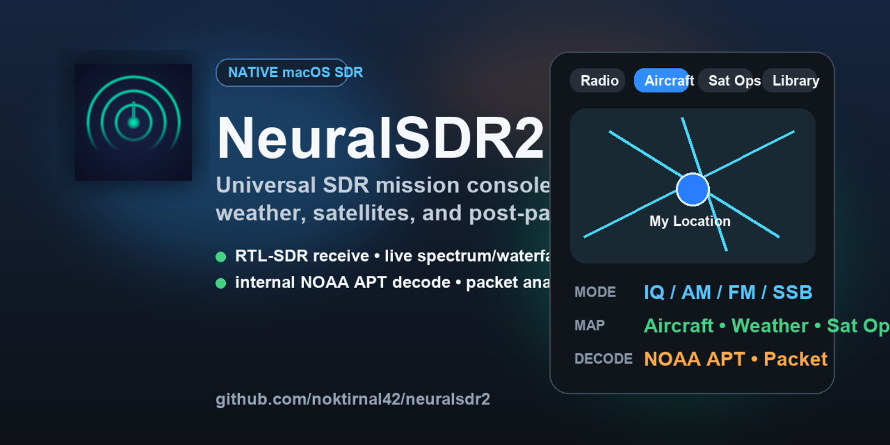

# NeuralSDR2

Native macOS SDR mission console for RTL-SDR workflows.

[](https://github.com/noktirnal42/neuralsdr2/actions/workflows/build.yml)




NeuralSDR2 is a native Swift/SwiftUI SDR application for macOS that combines live radio tuning, aircraft/weather mapping, satellite pass operations, recording, and internal post-pass decode workflows in one desktop app.

The project started as a traditional receiver UI and has been pushed toward a more operational "universal map + radio console + library" shape. It now includes a shared map workspace for aircraft, weather, and satellites, internal NOAA APT decode artifacts, packet post-pass analysis, and a growing library/replay workflow.

## What It Is

NeuralSDR2 is built around five main working modes:

- `Radio`: live spectrum, waterfall, demodulation, manual tuning, and recording
- `Aircraft`: shared map workspace for ADS-B traffic and dump978 weather overlay
- `Sat Ops`: satellite pass planning, Doppler tracking, pass recording, and post-pass workflows
- `3D Earth`: orbital context and space situational awareness view
- `Library`: recordings, decoded NOAA products, packet reports, and replay/decode-again actions

## Current Capabilities

### SDR Core

- RTL-SDR device detection, open/configure/start/stop, and async IQ streaming
- Demodulation modes: `IQ`, `AM`, `NFM`, `WFM`, `USB`, `LSB`, `CW`, `DMR`, `P25`, `DSTAR`
- Real-time spectrum and waterfall displays
- AGC, squelch, bandwidth control, and speaker monitor mute
- IQ and audio recording paths

### Universal Map

- Shared map surface for aircraft, weather, and satellite operations
- Device/observer location annotation and location-aware observer updates
- dump978 raw feed integration for FIS-B weather overlay
- Decoded NOAA overlay support
- Weather freshness and NOAA quality filtering

### Satellite Ops

- TLE-backed satellite tracking and pass prediction
- Live Doppler status and optional retune workflow
- Per-satellite tuning profiles and receive presets
- Pass queueing and auto-record support
- Internal post-pass routing for decode workflows

### Internal Decode Workflows

- Internal NOAA APT image generation with decoded artifact metadata
- Channel A / Channel B NOAA outputs
- NOAA quality scoring, library surfacing, and map overlay linking
- Internal packet audio analysis/report workflow
- Library-side `Listen` and `Decode Again` actions for saved captures

### Library and Review

- Recent recordings and decoded artifact library
- Latest NOAA and packet session panels
- Replay of saved audio captures
- Re-run internal decode from saved recordings

## Visual Overview


Branding assets committed in this repository:

- [`docs/assets/hero.png`](docs/assets/hero.png)
- [`docs/assets/social-preview.png`](docs/assets/social-preview.png)
- [`docs/assets/app-icon.png`](docs/assets/app-icon.png)

## Project Status

NeuralSDR2 is already usable as a real desktop SDR application, but it is still actively evolving.

What is working well now:

- RTL-SDR bring-up and live receive
- Radio console and recording flow
- Universal map shell for aircraft/weather/satellites
- NOAA pass recording and internal decode artifact generation
- Packet post-pass analysis flow

What is still rough or incomplete:

- Spectrum/waterfall presentation still needs continued polish
- Some decoder modes are present but not yet mature end-to-end
- Digital voice/internal decoder depth is still behind the NOAA path
- Packaging/distribution polish is improving but not yet "finished product" level

## Build From Source

### Requirements

- macOS 13 or newer
- Xcode Command Line Tools
- [Homebrew](https://brew.sh/)
- `librtlsdr`

Install the native dependency:

```bash
brew install librtlsdr
```

Build and test:

```bash
swift build
swift test
```

Run the app from SwiftPM:

```bash
swift run NeuralSDR2
```

Build a local `.app` bundle:

```bash
bash ./build_app.sh
open ./releases/NeuralSDR2.app
```

## Repository Layout

```text
.
├── Package.swift
├── Sources/NeuralSDR2App/      # SwiftPM app entrypoint
├── src/
│   ├── App/                    # App state and runtime coordination
│   ├── Audio/                  # Audio engine/output
│   ├── DSP/                    # DSP core, demodulators, analyzers, decoders
│   ├── Hardware/               # RTL-SDR, USB monitor, dump978 integration
│   ├── Recording/              # Recording manager and metadata
│   ├── Satellite/              # Tracking, pass prediction, NOAA decode helpers
│   ├── UI/                     # SwiftUI/AppKit UI, map, displays, library
│   └── Resources/              # App icon and bundled resources
├── tests/                      # Unit and integration tests
├── docs/                       # Specs, guides, and progress docs
├── scripts/                    # Packaging, appcast, signing helpers
└── distribution/               # Release metadata and formulas
```

## Docs

Start here if you want the product and architecture context:

- [Project Summary](docs/00-PROJECT-SUMMARY.md)
- [Feature Specification](docs/01-FEATURE-SPECIFICATION.md)
- [System Architecture](docs/02-SYSTEM-ARCHITECTURE.md)
- [UI/UX Specification](docs/04-UI-UX-SPECIFICATION.md)
- [Quickstart](docs/QUICKSTART.md)
- [User Guide](docs/USER-GUIDE.md)

## Releases

The repository includes local packaging scripts and a GitHub Actions workflow for build/test/release automation.

- CI workflow: [`.github/workflows/build.yml`](.github/workflows/build.yml)
- Local package script: [`build_app.sh`](build_app.sh)
- Distribution metadata: [`distribution/`](distribution)

## Contributing

Contributions are welcome, especially around:

- DSP correctness and performance
- decoder depth and protocol support
- spectrum/waterfall rendering polish
- map UX and operational workflows
- packaging, signing, and release automation

Please start with [CONTRIBUTING.md](CONTRIBUTING.md).

## License

NeuralSDR2 is released under the [GPLv3](LICENSE).

## Acknowledgments

This project is informed by the SDR and radio tooling ecosystem, especially:

- [RTL-SDR](https://www.rtl-sdr.com/)
- [GNU Radio](https://www.gnuradio.org/)
- [SatDump](https://github.com/SatDump/SatDump)
- [dump1090](https://github.com/flightaware/dump1090)
- [dump978](https://github.com/flightaware/dump978)

---

NeuralSDR2 is aiming to be a native macOS SDR operations console, not just a tuner window.
